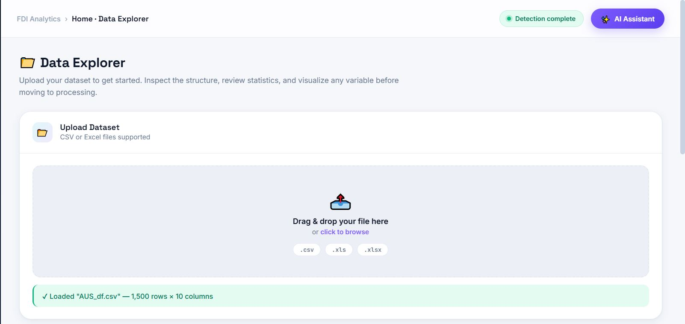
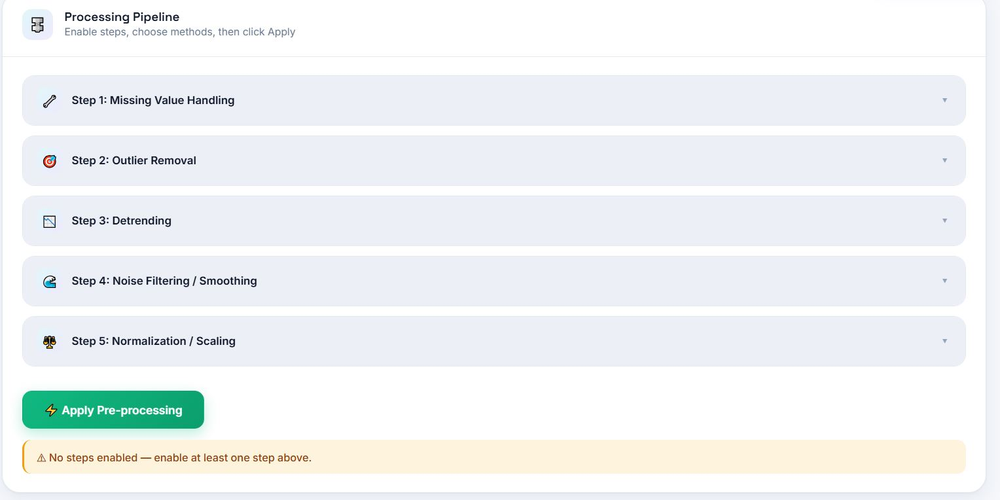
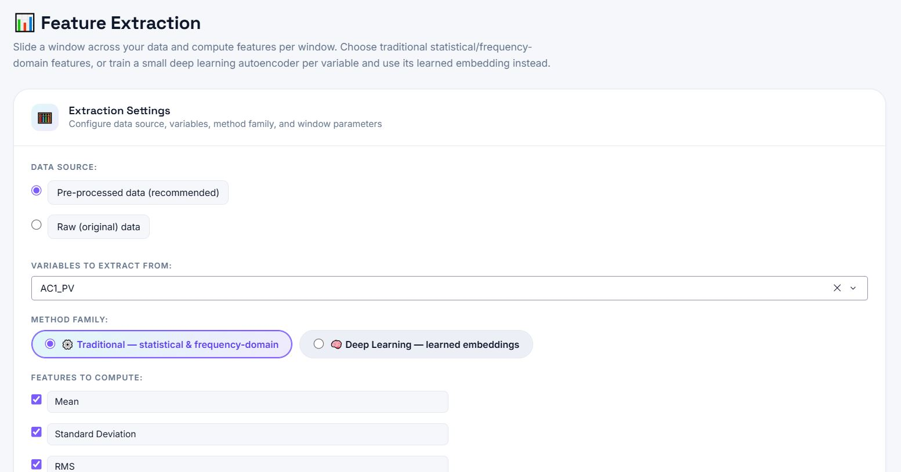
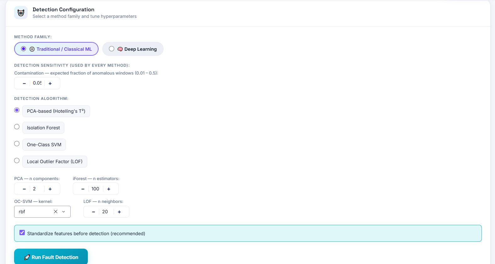
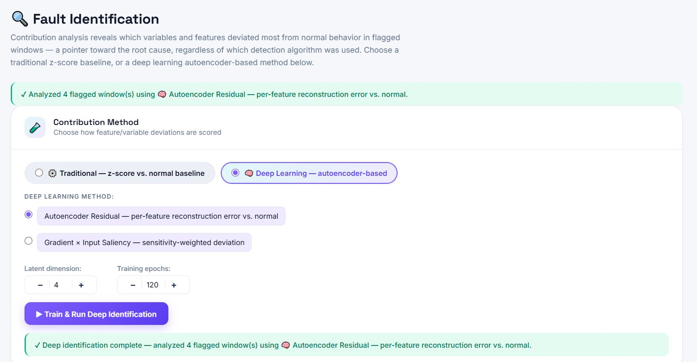
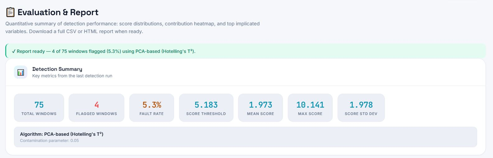
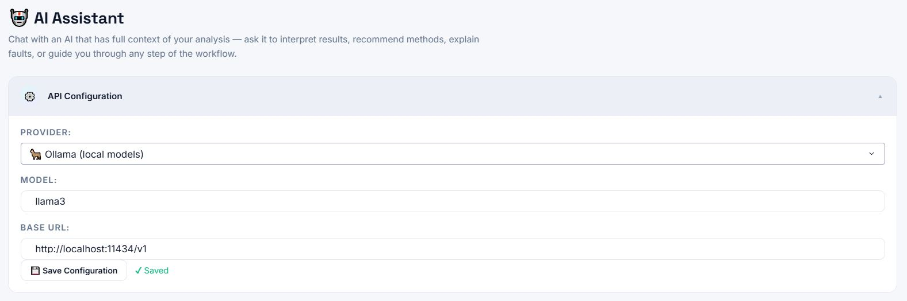

<div align="center">

# ⚡ FDI Analytics Toolbox &nbsp; <sup>v1.1</sup>

### Unsupervised Fault Detection & Identification for Industrial Sensor Data

[](https://www.python.org/)
[](https://dash.plotly.com/)
[](https://scikit-learn.org/)
[](https://pytorch.org/)
[](https://fdi-analytics-app.azurewebsites.net)
[](#)
[](#license)

**No labeled fault data. No code. No installation.**
Upload a CSV, walk a six-stage pipeline, get fault windows, root-cause rankings, and AI-assisted interpretation — all in the browser.

[**🚀 Launch App**](https://fdi-analytics-app.azurewebsites.net) &nbsp;·&nbsp; [**📘 User Manual**](docs/user_manual.pdf) &nbsp;·&nbsp; [**⚡ Quick-Start Guide**](docs/quickstart.pdf) &nbsp;·&nbsp; [**🎬 Video Walkthrough**](docs/demo_video.mp4)

</div>

---

## 🖥️ Screenshots

| 🏠 Home — Data Explorer | ⚙️ Pre-processing |
|:---:|:---:|
|  |  |

| 📊 Feature Extraction | 🚨 Fault Detection |
|:---:|:---:|
|  |  |

| 🔍 Fault Identification | 📋 Report & Export |
|:---:|:---:|
|  |  |

| 🤖 AI Assistant — dataset-aware analysis guidance |
|:---:|
|  |

---

## 📌 Table of Contents

- [Overview](#-overview)
- [Pipeline](#-pipeline)
- [Features](#-features)
- [Tech Stack](#-tech-stack)
- [Usage](#-usage)
- [Documentation](#-documentation)
- [Architecture & Deployment](#-architecture--deployment)
- [Roadmap — Version 2](#-roadmap--version-2)
- [License](#-license)

---

## 🔍 Overview

**FDI Analytics** is a no-code condition monitoring toolbox for engineers and researchers working with industrial time-series data. It implements a complete Fault Detection and Identification (FDI) pipeline using only **unsupervised machine learning** — no historical fault labels, no annotations, no separate training dataset required.

**👥 Who is this for?**
- 🏭 Process engineers monitoring plant equipment (pumps, compressors, heat exchangers, reactors)
- 🔬 Researchers prototyping anomaly detection workflows on new sensor datasets
- 🎓 Students learning signal processing and unsupervised ML in an applied setting

> **Key principle:** a short segment of normal operation is used as a baseline — everything that deviates from it is scored and ranked automatically.

> **Version:** Currently at v1.1. See the [Roadmap](#-roadmap--version-2) for what's coming next.

> **Note:** This project is hosted as a live web application. Source code is not publicly distributed. See [License](#-license).

---

## 🔄 Pipeline

Six sequential stages, each building on the previous:

```
 ┌─────────────────┐     ┌──────────────────────┐     ┌──────────────────────────┐
 │  1. 🏠 Home     │ →   │  2. ⚙️ Pre-processing │ →   │  3. 📊 Feature Extraction │
 │  Data Upload    │     │  Signal Conditioning  │     │  Window-based Features   │
 └─────────────────┘     └──────────────────────┘     └──────────────────────────┘
                                                                     ↓
 ┌─────────────────┐     ┌──────────────────────┐     ┌──────────────────────────┐
 │  6. 📋 Report   │ ←   │  5. 🔍 Identification │ ←   │  4. 🚨 Detection          │
 │  Export & AI   │     │  Root-Cause Ranking   │     │  Anomaly Scoring          │
 └─────────────────┘     └──────────────────────┘     └──────────────────────────┘
```

| Stage | Description |
|-------|-------------|
| 🏠 **Home** | Upload CSV/Excel, inspect raw signals, define the normal-operation baseline window |
| ⚙️ **Pre-processing** | Apply up to 5 sequential signal conditioning steps per variable |
| 📊 **Feature Extraction** | Compute statistical/frequency-domain features or deep-learned embeddings per sliding window |
| 🚨 **Detection** | Score each window with an unsupervised anomaly detector; flag windows above threshold |
| 🔍 **Identification** | Rank variables and features by their contribution to each flagged anomaly |
| 📋 **Report** | Summary statistics, score distributions, contribution heatmaps; export CSV or HTML; AI assistant |

---

## ✨ Features

### ⚙️ Signal Pre-processing
Five configurable conditioning stages, each with multiple method options:

| Stage | Methods |
|-------|---------|
| 🩹 Missing value handling | Drop rows · Mean imputation · Median imputation · Linear interpolation |
| 🎯 Outlier removal | Z-score clipping · IQR clipping · Hampel filter |
| 📉 Detrending | Linear detrend · First-order differencing · Moving-average baseline removal |
| 🔇 Noise filtering | Moving average · Median filter · Savitzky-Golay · Exponential smoothing |
| ⚖️ Normalization | Min-Max · Z-score standardization · Robust scaling |

### 📊 Feature Extraction

**🔢 Traditional (statistical & frequency-domain):**
Mean · Std · RMS · Variance · Skewness · Kurtosis · Peak-to-Peak · Crest Factor · Dominant Frequency (FFT) · Spectral Energy (FFT)

**🧠 Deep learning embeddings** *(optional — requires PyTorch)*:
- Dense Autoencoder — compact nonlinear embedding
- LSTM Autoencoder — captures temporal dependencies
- 1D-CNN Autoencoder — captures local waveform shape

### 🚨 Fault Detection

**📐 Classical (unsupervised):**
- PCA-based (Hotelling's T²)
- Isolation Forest
- One-Class SVM
- Local Outlier Factor (LOF)

**🧠 Deep learning** *(optional — requires PyTorch)*:
- Autoencoder — reconstruction-error anomaly score
- Variational Autoencoder (VAE) — probabilistic reconstruction error
- Deep SVDD — one-class hypersphere distance

### 🔍 Fault Identification
Root-cause contribution analysis to pinpoint which variables and features are driving each anomaly:
- 📏 Z-score deviation from normal baseline per feature
- 🔁 Autoencoder residual — per-feature reconstruction error
- 🎯 Gradient × Input Saliency *(deep learning only)*

### 🤖 AI Assistant
Built-in LLM assistant with full awareness of the current pipeline state. Supports:

| Provider | Default Model |
|----------|--------------|
| 🟢 OpenAI | gpt-4o |
| 🟣 Anthropic | claude-3-5-sonnet |
| 🦙 Ollama (local) | llama3 |
| ⚙️ Custom endpoint | configurable |

Pre-built quick prompts: interpret results · recommend preprocessing · compare methods · summarize findings · suggest next steps · optimize window parameters.

### 🎨 UX Highlights
- 🗂️ Dark sidebar with a waterfall pipeline stepper — shows progress at a glance
- ⏳ Live progress bars + **Cancel** button on all long-running jobs
- ✅ **Select All / Clear** on variable selection dropdowns
- 📥 Export results as CSV or a self-contained HTML report
- 🌐 Works in any modern browser — no installation required for end users

---

## 🛠️ Tech Stack

| Layer | Library | Version |
|-------|---------|---------|
| 🌐 Web framework | [Dash](https://dash.plotly.com/) | 2.17 |
| 📈 Plotting | [Plotly](https://plotly.com/python/) | 5.24 |
| 🗃️ Data | [Pandas](https://pandas.pydata.org/) · [NumPy](https://numpy.org/) | 2.2 · 1.26 |
| 〰️ Signal processing | [SciPy](https://scipy.org/) | 1.13 |
| 🤖 Classical ML | [scikit-learn](https://scikit-learn.org/) | 1.5 |
| 🧠 Deep learning *(optional)* | [PyTorch](https://pytorch.org/) | 2.x CPU |
| ⚡ Background callbacks | [diskcache](https://grantjenks.com/docs/diskcache/) via `dash[diskcache]` | — |
| ☁️ Hosting | [Azure App Service](https://azure.microsoft.com/en-us/products/app-service) | B2 Linux |

---

## 🚀 Usage

The app is accessible at **[fdi-analytics-app.azurewebsites.net](https://fdi-analytics-app.azurewebsites.net)** — no installation or account required.

1. 🏠 **Home** — Upload your CSV/Excel file. Inspect raw signal plots. Set the baseline window (normal operation) using the range sliders.

2. ⚙️ **Pre-processing** — Enable and configure each conditioning step. Preview the before/after effect on your signals.

3. 📊 **Feature Extraction** — Choose variables, window parameters (size, step, sampling frequency), and features to compute. Run extraction.

4. 🚨 **Detection** — Select a detection method and configure its hyperparameters. Run detection to get an anomaly score for every window.

5. 🔍 **Identification** — View a ranked heatmap of variable and feature contributions. Understand which sensor and which aspect of its signal is most anomalous.

6. 📋 **Report** — Review summary statistics, score distribution, and contribution heatmap. Ask the AI assistant questions. Export as CSV or HTML.

📖 For a guided walkthrough, see the [Quick-Start Guide](docs/quickstart.pdf) or [Video Walkthrough](docs/demo_video.mp4).

---

## 📚 Documentation

| Document | Description |
|----------|-------------|
| 📘 [User Manual](docs/user_manual.pdf) | Full operator reference — every page, control, method, and parameter explained in plain language |
| ⚡ [Quick-Start Guide](docs/quickstart.pdf) | Picture-led, one-pass walkthrough — from CSV to fault report in under 10 minutes |
| 🎬 [Video Walkthrough](docs/demo_video.mp4) | End-to-end case study on a real industrial dataset |

---

## 🏗️ Architecture & Deployment

### 🧱 Technology Stack

The application is built entirely in Python. The frontend and backend are unified in a single Dash application — Dash renders the UI as React components in the browser while the Python backend handles all data processing, ML inference, and callback logic. Styling is handled via a custom CSS stylesheet using a cyan/violet design system with CSS variables for theming.

```
🌐 Browser (React / Plotly)
        ↕  HTTP
🐍 Python backend (Dash + Flask)
        ↕
📐 scikit-learn · SciPy · NumPy · 🧠 PyTorch (optional)
        ↕
💾 diskcache  ←  background callbacks (progress bars, Cancel button)
```

### 🐳 Containerisation

The app is packaged as a **Docker container** for portable, reproducible deployment. The `Dockerfile` uses a Python 3.12 slim base image, installs CPU-only PyTorch from the official wheel index (keeping the image size manageable), and serves the app via **Waitress** (a production WSGI server) with a generous channel timeout to accommodate long-running ML jobs.

### ☁️ Cloud Deployment — Microsoft Azure

The live app is hosted on **Azure App Service** in the `canadacentral` region. Key decisions made during deployment:

- 🔒 **Single instance only** — the diskcache background callback system stores job state on local disk, making horizontal scaling incompatible. Azure App Service was chosen over Azure Container Apps (which autoscales by default) for this reason.
- 🏗️ **Azure Container Registry (ACR)** was provisioned for image storage. ACR Tasks (`az acr build`) are restricted on the Azure for Students subscription tier; the final pipeline uses `az webapp up` with Azure's Oryx build system, which installs dependencies server-side from `requirements.txt` on each deployment.
- 💪 **B2 tier** (2 vCPU, 3.5 GB RAM) was selected after confirming that B1 (1.75 GB RAM) caused startup timeouts when loading the full ML stack into memory simultaneously on a cold start.
- ⚡ **Gunicorn** (pre-installed in Azure's Python runtime image) serves the app with `--workers=1` to maintain diskcache compatibility and `--timeout 600` to handle long-running detection and training jobs.

---

## 🗺️ Roadmap — Version 2

The following improvements are planned for the next release:

- 🐛 **Bug fixes** — known edge cases identified during v1 testing will be addressed
- ⚡ **Execution speed** — optimisation of the feature extraction and detection pipelines for large datasets
- 🤖 **LLM interpretation** — richer, more context-aware AI assistant responses with better fault-specific guidance
- 🔗 **Causality analysis** — moving beyond correlation-based contribution ranking to causal inference between sensor variables
- 📊 **Report & identification metrics** — an expanded report section with more interpretable fault identification metrics, clearer visualisations, and actionable maintenance recommendations

---

## 📄 License

© 2026 Mohammad Modirrousta. All rights reserved.

This repository contains documentation and project resources only. The application source code is proprietary. No part of the source code may be reproduced, distributed, or used without explicit written permission from the author.

For collaboration or licensing enquiries, contact via [GitHub](https://github.com/mhmodir).

---

<div align="center">

🐍 Built with [Dash](https://dash.plotly.com/) &nbsp;·&nbsp; ☁️ Hosted on [Azure App Service](https://azure.microsoft.com/en-us/products/app-service)

**[github.com/mhmodir](https://github.com/mhmodir)**

</div>
